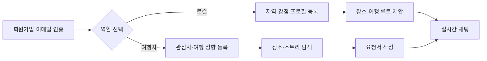

# 여행자-로컬 매칭 플랫폼 백엔드

여행자와 현지 로컬을 연결하고, 관심사에 맞는 장소·여행 루트·스토리를 탐색할 수 있도록 지원하는 백엔드 서비스입니다.  
사용자 역할에 따른 온보딩부터 장소 저장, 제안 요청, 실시간 채팅까지 여행 경험에 필요한 데이터 흐름을 API로 제공합니다.

## 주요 기능

### 회원 및 역할별 온보딩

- 회원가입 및 이메일 인증
- JWT 기반 로그인·로그아웃
- 여행자와 로컬 역할 구분
- 역할에 따른 다음 온보딩 단계 안내
- 관심사, 언어, 지역, 여행 성향 등 프로필 관리
- 로컬 사용자 Instagram 인증 요청 및 상태 관리

### 장소 탐색

- 여행 장소 목록 및 상세 조회
- 로컬 사용자의 장소 등록
- 지역별 장소 검색
- 장소 좋아요 및 좋아요 목록
- 국가·도시별 인기 장소 순위
- Hot Spot 및 Trend Spot 조회
- 여러 위시리스트와 위시리스트 항목 관리

### 요청서 및 여행 루트

- 여행 제안 요청서 작성·조회·수정·삭제
- 로컬이 제안하는 여행 루트 관리
- 요청서와 여행 루트 연결
- 테마 태그 조회
- 이미지 업로드

### 여행 스토리

- 여행 스토리 작성·조회·수정·삭제
- 조회수 증가
- 좋아요 토글
- 댓글 작성·조회·삭제
- 스토리 이미지 업로드

### 채팅

- 채팅방 생성 및 목록·상세 조회
- 채팅 메시지 작성·조회·삭제
- 채팅 이미지 업로드
- 채팅방 확정 상태 관리
- Django Channels 기반 WebSocket 실시간 메시지 처리

## 기술 스택

| 구분 | 기술 |
| --- | --- |
| Backend | Python, Django 5.2, Django REST Framework |
| Authentication | Simple JWT, 이메일 인증 |
| Database | MySQL, Django ORM |
| Realtime | Django Channels, WebSocket |
| API | django-filter, REST API |
| Server | Uvicorn, Gunicorn |
| Etc. | django-cors-headers, python-decouple, python-dotenv |

## 프로젝트 구조

```text
demo/
├── account/           # 회원, JWT 인증, 역할, 관심사, 프로필, 온보딩
├── PlaceApp/          # 장소, 좋아요, 인기 순위, 위시리스트
├── DocumentApp/       # 제안 요청서, 여행 루트, 테마 태그
├── StoryApp/          # 여행 스토리, 조회수, 좋아요, 댓글
├── ChatApp/           # 채팅방, 메시지, WebSocket
├── demo/              # Django 설정, URL, ASGI/WSGI
├── manage.py
└── requirements.txt
```

## 서비스 흐름



## 주요 API

### Account

| Method | Endpoint | 설명 |
| --- | --- | --- |
| POST | `/account/signup/` | 회원가입 및 인증 메일 발송 |
| GET | `/account/verify-email/{token}/` | 이메일 인증 |
| POST | `/account/login/` | JWT 로그인 |
| POST | `/account/logout/` | 로그아웃 |
| GET | `/account/me/` | 현재 사용자 조회 |
| GET | `/account/onboarding/next/` | 다음 온보딩 단계 조회 |
| GET | `/account/interests/` | 관심사 목록 조회 |
| GET, PUT, PATCH | `/account/profile/local/` | 로컬 프로필 관리 |
| GET, PUT, PATCH | `/account/profile/user/` | 여행자 프로필 관리 |
| POST | `/account/role/switch/` | 역할 전환 |

### Place

| Method | Endpoint | 설명 |
| --- | --- | --- |
| GET, POST | `/place/places/` | 장소 목록 및 등록 |
| POST | `/place/places/create-by-local/` | 로컬 사용자 장소 등록 |
| GET | `/place/places/{id}/` | 장소 상세 조회 |
| GET | `/place/places/by-region/` | 지역별 장소 조회 |
| POST | `/place/places/{id}/like/` | 장소 좋아요 토글 |
| GET | `/place/likes/` | 좋아요한 장소 조회 |
| GET | `/place/hotspots/` | 인기 장소 조회 |
| GET, POST | `/place/wishlists/` | 위시리스트 관리 |
| GET, POST | `/place/wishlists/{id}/items/` | 위시리스트 항목 관리 |

### Document / Route

| Method | Endpoint | 설명 |
| --- | --- | --- |
| GET, POST | `/document/requests/` | 여행 제안 요청서 목록 및 작성 |
| GET, PUT, PATCH, DELETE | `/document/requests/{id}/` | 요청서 상세 관리 |
| GET, POST | `/document/roots/` | 여행 루트 목록 및 작성 |
| GET, PUT, PATCH, DELETE | `/document/roots/{id}/` | 여행 루트 상세 관리 |
| GET | `/document/theme-tags/` | 테마 태그 조회 |
| POST | `/document/upload-image/` | 이미지 업로드 |

### Story / Chat

| Method | Endpoint | 설명 |
| --- | --- | --- |
| GET, POST | `/story/stories/` | 여행 스토리 목록 및 작성 |
| GET, PUT, PATCH, DELETE | `/story/stories/{id}/` | 스토리 상세 관리 |
| POST | `/story/stories/{id}/like/` | 스토리 좋아요 토글 |
| GET, POST | `/story/stories/{id}/comments/` | 댓글 조회 및 작성 |
| GET, POST | `/chat/rooms/` | 채팅방 목록 및 생성 |
| GET, POST | `/chat/rooms/{id}/messages/` | 채팅 메시지 조회 및 작성 |
| POST | `/chat/rooms/{id}/upload-image/` | 채팅 이미지 업로드 |

## 로컬 실행

### 1. 저장소 복제

```bash
git clone https://github.com/younggyu7/13-DEMODAY-BACKEND-TEAM02.git
cd 13-DEMODAY-BACKEND-TEAM02/demo
```

### 2. 가상환경 및 패키지 설치

```bash
python -m venv venv
source venv/bin/activate
pip install -r requirements.txt
```

Windows에서는 다음 명령으로 가상환경을 활성화합니다.

```bash
venv\Scripts\activate
```

### 3. 환경변수 설정

프로젝트 루트에 `.env.prod`를 만들되 실제 파일은 Git에 올리지 않습니다.

```env
SECRET_KEY=
DEBUG=True

DB_NAME=
DB_USER=
DB_PASSWORD=
DB_HOST=
DB_PORT=3306

EMAIL_HOST_USER=
EMAIL_HOST_PASSWORD=
```

### 4. 데이터베이스 적용 및 실행

```bash
python manage.py migrate
python manage.py runserver
```

WebSocket 기능을 포함해 ASGI 서버로 실행하려면 다음과 같이 실행할 수 있습니다.

```bash
uvicorn demo.asgi:application --reload
```

## 구현 시 고려한 점

- 여행자와 로컬 역할별로 접근 권한과 온보딩 단계를 구분했습니다.
- JWT를 응답과 HttpOnly 쿠키에 함께 제공하도록 구성했습니다.
- 장소 좋아요·위시리스트·스토리 기능을 별도 도메인으로 분리했습니다.
- 목록과 상세 API에 필요한 Serializer와 QuerySet을 구분했습니다.
- REST API와 WebSocket을 함께 사용해 일반 데이터 조회와 실시간 채팅을 분리했습니다.
- 비밀키·DB·이메일 인증정보는 환경변수로 관리해야 합니다.

## Repository

[younggyu7/13-DEMODAY-BACKEND-TEAM02](https://github.com/younggyu7/13-DEMODAY-BACKEND-TEAM02)
