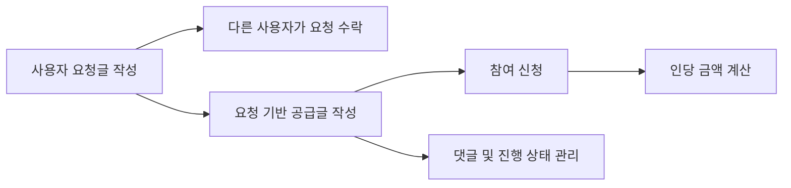

# 신촌톤 백엔드

요청이 필요한 사용자와 도움·물품을 제공할 수 있는 사용자를 연결하는 백엔드 API입니다.  
사용자는 요청글을 작성하고 다른 사용자가 이를 수락할 수 있으며, 요청을 바탕으로 공동구매·나눔 성격의 공급글을 생성하고 참여할 수 있습니다.

## 주요 기능

### 회원 및 인증

- 이메일 기반 회원가입 및 로그인
- JWT Access/Refresh Token 발급
- 현재 사용자 정보 조회
- 내가 작성한 공급글 및 참여한 공급글 조회

### 요청글

- 요청글 목록 조회 및 작성
- 요청글 상세 조회·수정·삭제
- 내가 작성한 요청글 조회
- 요청 수락 및 상태 관리
- 요청글 댓글 작성 및 조회

### 공급글

- 공급글 목록 조회 및 작성
- 공급글 상세 조회·수정·삭제
- 제목·내용 기반 검색과 날짜 기준 정렬
- 공급글 참여 및 참여자 중복 방지
- 총액과 모집 인원에 따른 인당 금액 계산
- 신청 마감 및 실행 시간 검증
- 공급글 댓글 작성
- 원본 요청글과 공급글 연결

## 기술 스택

| 구분 | 기술 |
| --- | --- |
| Backend | Python, Django 5.2, Django REST Framework |
| Authentication | Simple JWT |
| Database | PostgreSQL |
| Data / Filtering | django-filter, Django ORM |
| Deployment | Gunicorn |
| Etc. | django-environ, django-cors-headers, Pillow |

## 프로젝트 구조

```text
.
├── accounts/          # 사용자 모델, 회원가입, 로그인, JWT 발급
├── Request/           # 요청글, 요청 수락, 요청글 댓글
├── supply/            # 공급글, 공동 참여, 금액 계산, 댓글
├── configs/           # Django 설정 및 최상위 URL
├── env_example/       # 환경변수 작성 예시
├── utils/             # 공통 상수, 선택지, 헬퍼, 데코레이터
├── manage.py
└── requirements.txt
```

## 데이터 흐름



## 주요 API

### Accounts

| Method | Endpoint | 설명 |
| --- | --- | --- |
| POST | `/accounts/` | 회원가입 및 토큰 발급 |
| GET | `/accounts/` | 현재 사용자 정보 조회 |
| POST | `/accounts/login` | 로그인 |
| GET | `/accounts/my-receive-request` | 내가 작성한 공급글 조회 |
| GET | `/accounts/my-join-request` | 내가 참여한 공급글 조회 |

### Request

| Method | Endpoint | 설명 |
| --- | --- | --- |
| GET, POST | `/request/` | 요청글 목록 조회 및 작성 |
| GET | `/request/mine/` | 내가 작성한 요청글 조회 |
| GET, PUT, PATCH, DELETE | `/request/{id}/` | 요청글 상세 관리 |
| POST | `/request/{id}/accept/` | 요청 수락 |
| GET, POST | `/request/{id}/comments/` | 요청글 댓글 조회 및 작성 |

### Supply

| Method | Endpoint | 설명 |
| --- | --- | --- |
| GET, POST | `/supply/` | 공급글 목록 조회 및 작성 |
| GET, PUT, PATCH, DELETE | `/supply/{id}/` | 공급글 상세 관리 |
| POST | `/supply/{id}/join/` | 공급글 참여 |
| GET | `/supply/{id}/quote/` | 예상 인당 금액 조회 |
| POST | `/supply/comment/` | 공급글 댓글 작성 |

## 로컬 실행

### 1. 저장소 복제

```bash
git clone https://github.com/younggyu7/sinchonton.git
cd sinchonton
```

### 2. 가상환경 및 패키지 설치

```bash
python -m venv venv
source venv/bin/activate
pip install -r requirements.txt
```

Windows에서는 다음 명령으로 가상환경을 활성화합니다.

```bash
venv\Scripts\activate
```

### 3. 환경변수 설정

실제 비밀번호와 비밀키는 Git에 올리지 않습니다. `env_example`의 형식을 참고해 실행 환경에 맞는 파일을 작성합니다.

```env
SECRET_KEY=
DEBUG=True
DATABASE_URL=
```

### 4. 데이터베이스 적용 및 서버 실행

```bash
python manage.py migrate
python manage.py runserver
```

## 구현 시 고려한 점

- 공급글 참여 시 동일 사용자의 중복 신청을 제한했습니다.
- 총액을 모집 인원으로 나누어 인당 금액을 올림 계산하도록 구성했습니다.
- 신청 마감 시간보다 실행 시간이 늦도록 Serializer에서 검증합니다.
- 목록·생성·상세 응답의 목적에 맞게 Serializer를 분리했습니다.
- JWT 인증이 필요한 기능과 공개 기능의 권한을 구분했습니다.

## Repository

[younggyu7/sinchonton](https://github.com/younggyu7/sinchonton)
